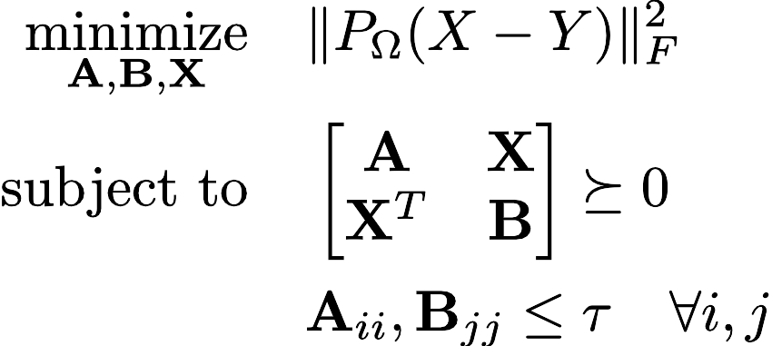

# Matrix Completion via Convex Programming

This repository provides implementations of various matrix completion algorithms based on convex optimization. Convex optimization is particularly useful in this context because it offers theoretical guarantees for the optimality of a solution. The algorithms here are designed to recover missing entries in partially observed and possibly corrupted matrices.

While many heuristic methods for matrix completion exist in the literature, they often lack rigorous guarantees for accurately recovering unseen entries. Moreover, these methods are frequently non-convex, meaning converegnce to a global solution is not assured.

To address these challenges, prior work has focused on recovering matrices by seeking low-rank or low-norm factorizations that minimize the least-squares error over the observed entries. Directly minimizing the rank of a matrix is non-convex, but can be efficiently approximated using its convex surrogate, the nuclear norm (i.e., the sum of the singular values) [[1](#ref1)].

Matrix completion has numerous applications, including recommendation systems [[2](#ref2)], collaborative filtering [[3](#ref3)], compressed sensing [[4](#ref4)], and phase retrieval [[5](#ref5)]. Many of these applications involve large-scale data, requiring algorithms that are both accurate and scalable. This repository emphasizes Frank-Wolfe-based algorithms [[6](#ref6)], which offer nearly linear runtime performance comparable to SVD-based methods, making them suitable for large-scale matrix completion tasks.

## Algorithms

### Nuclear Norm Matrix Factorization

This algorithm solves the convex relaxation of rank minimization by replacing the matrix rank with its nuclear norm (sum of singular values):

$$
\begin{aligned}
\underset{\mathbf{X}}{\text{minimize}}  \quad & \| P_\Omega(X - Y) \|_F^2 \\
\text{subject to} \quad & \| X \|_* \leq \tau
\end{aligned}
$$

where $P_\Omega$ is the projection onto the set of observed entries. This formulation promotes a low-rank structure in $\mathbf{X}$ and is robust to additive noise in the observed entries. The low-rank factorization is computed efficiently using a *Frank-Wolfe* algorithm. Additionally, the equation above can be represented as a semidefinite program (SDP):

$$
\begin{aligned}
    \underset{\mathbf{A}, \mathbf{B}, \mathbf{X}}{\text{minimize}}  \quad & \| P_\Omega(X - Y) \|_F^2 \\
    \text{subject to} \quad & \text{tr}(\mathbf{A}) + \text{tr}(\mathbf{B}) \leq 2\tau \\
    & \begin{bmatrix}
    \mathbf{A} & \mathbf{X} \\
    \mathbf{X}^T & \mathbf{B}
    \end{bmatrix} \succeq 0
\end{aligned}
$$

➡️ **View [Numpy](matrix_completion/numpy/NNMF.py) or [PyTorch](matrix_completion/pytorch/NNMF.py) implementation**

### Maximum Margin Matrix Factorization

While the nuclear norm has been shown to be a useful relaxation for minimizing the rank of a matrix, other approaches to collaborative filtering have suggested using finding low-norm factorizations inside of low-rank factorizations [[3](#ref3)]. As was first shown in [[1](#ref1)], for a matrix $\mathbf{X} = \mathbf{U}\mathbf{V}^T$, the nuclear norm has the following relationship:

$$
\begin{aligned}
    \|\mathbf{X}\|_* &= \min_{\mathbf{X} = \mathbf{U}\mathbf{V}^T} \|\mathbf{U}\|_F \|\mathbf{V}\|_F \\
    &= \min_{\mathbf{X} = \mathbf{U}\mathbf{V}^T} \frac{1}{2} \Big( \|\mathbf{U}\|_F^2 + \|\mathbf{V}\|_F^2 \Big)
\end{aligned}
$$

where the second equality is due to the AM-GM inequality. Therefore, the nuclear norm constrains all the elements in $\mathbf{U}$ and $\mathbf{V}$ on average to have low $L_2$ norm. Instead of penalizing the average of the rows in $\mathbf{U}$ and $\mathbf{V}$, the method in [[3](#ref3)] proposed replacing the nuclear norm with the *max norm*:

$$
\begin{aligned}
    \|\mathbf{X}\|_{max} &= \min_{\mathbf{X} = \mathbf{U}\mathbf{V}^T} (\text{max}_i \|\mathbf{U}_i\|_2) (\text{max}_j \|\mathbf{V}_j\|_2) \\
    &= \min_{\mathbf{X} = \mathbf{U}\mathbf{V}^T} \frac{1}{2} \Big( \text{max}_i \|\mathbf{U}_i\|_2^2 + \text{max}_j \|\mathbf{V}_j\|_2^2 \Big)
\end{aligned}
$$

where $\mathbf{U}_i$ and $\mathbf{V}_j$ are the rows of $\mathbf{U}$ and $\mathbf{V}$. The max norm has a geometric interpretation that is similar to Support Vector Machines. For a matrix where only a few of the entries are known and that may be partially corrupted by noise, the max norm matrix factorization can found by solving the following SDP:
 
$$
\begin{aligned}
    \underset{\mathbf{A}, \mathbf{B}, \mathbf{X}}{\text{minimize}}  \quad & \| P_\Omega(X - Y) \|_F^2 \\
    \text{subject to} \quad 
    & \begin{bmatrix}
    \mathbf{A} & \mathbf{X} \\
    \mathbf{X}^T & \mathbf{B}
    \end{bmatrix} \succeq 0 \\
    & \mathbf{A}_{ii}, \mathbf{B}_{jj} \leq \tau \quad \forall i, j \\
\end{aligned}
$$

<div style="text-align:center">
    
</div>

➡️ **View [Numpy](matrix_completion/numpy/MMMF.py) or [PyTorch](matrix_completion/pytorch/MMMF.py)  implementation**

## Examples

```bash
./run.sh experiments.run_NNMF --max_iter=500
```

## References

<a id="ref1"></a>[1] Fazel, Maryam. *Matrix rank minimization with applications*. Diss. PhD thesis, Stanford University, 2002.

<a id="ref2"></a>[2] Kang, Zhao, Chong Peng, and Qiang Cheng. "Top-n recommender system via matrix completion." *Proceedings of the AAAI conference on artificial intelligence*. Vol. 30. No. 1. 2016.

<a id="ref3"></a>[3] Srebro, Nathan, Jason Rennie, and Tommi Jaakkola. "Maximum-margin matrix factorization." *Advances in neural information processing systems* 17 (2004).

<a id="ref4"></a>[4] Recht, Benjamin, Maryam Fazel, and Pablo A. Parrilo. "Guaranteed minimum-rank solutions of linear matrix equations via nuclear norm minimization." *SIAM review* 52.3 (2010): 471-501.

<a id="ref5"></a>[5] Candes, Emmanuel J., et al. "Phase retrieval via matrix completion." SIAM review 57.2 (2015): 225-251.

<a id="ref6"></a>[6] Jaggi, Martin. "Revisiting Frank-Wolfe: Projection-free sparse convex optimization." *International conference on machine learning*. PMLR, 2013.

<a id="ref7"></a>[7] Candes, Emmanuel J., and Yaniv Plan. "Matrix completion with noise." *Proceedings of the IEEE* 98.6 (2010): 925-936.
